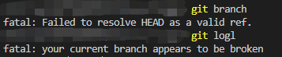

# 开发时碰到棘手的errors

1. 开发时断电后本地`git`崩溃

当前解决方案：重新拉取分支，切换到对应分支替换`/src`下文件

警示：本地切换多分支开发还是应该`push`到远程，进行一个备份，以免遇到`git`崩溃、电脑崩溃、磁盘损坏等事件

2. `Webpack5`配合`mini-css-extract-plugin`打包时将业务代码中的`3968`全部替换成`61a7`的问题

版本
```
"webpack": "^5.75.0",
"webpack-bundle-analyzer": "^4.4.2",
"webpack-cli": "^4.10.0",
"mini-css-extract-plugin": "^1.3.4",
```
webpack.prod.js
```
new MiniCssExtractPlugin({
    filename: 'style/[name].[contenthash:4].css',
    chunkFilename: 'style/[name].[contenthash:4].css',
}),
```
当前解决方案：将`[contenthash:4]`去掉长度改成`[contenthash].css`打包

思考：虽然还没来得及查找问题根源，但应该是个有意思的`bug`，当业务代码中数字足够多时，会不会就一定会出现这种`bug`？？