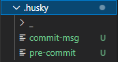

# [husky](https://typicode.github.io/husky/#/)版本4升级7

> 当提交或推送时，可以使用它来规范提交消息、运行测试、lint代码等。Husky支持所有的Git钩子 --- Modern native git hooks made easy

### husky4-7升级步骤
**npm**
```
npm install husky@latest --save-dev
```
```
npx husky-init
```
```
<!-- npm6及以下版本 -->
npx github:typicode/husky-4-to-7 --remove-v4-config
<!-- npm7版本 -->
npm exec -- github:typicode/husky-4-to-7 --remove-v4-config
```

以上三条命令执行后，会自动去除掉`package.json`里面的`husky`配置，并在项目根目录生成`.husky`文件夹及配置文件，最后检查下`package.json`的版本是否最新版本，不是的话再运行下`npm install husky@latest --save-dev`命令。写这篇文章`husky`升级版本为`4.3.8`到`7.0.2`

---
这个升级过程最有意思的是发现了`npm`可以直接从`github`存储库调用命令，`npm7`对应的[npm-exec文档](https://docs.npmjs.com/cli/v7/commands/npm-exec)，`npm6`对应的[npx文档](https://github.com/npm/npx)

> 参考地址：
- [husky-4-to-7](https://github.com/typicode/husky-4-to-7)