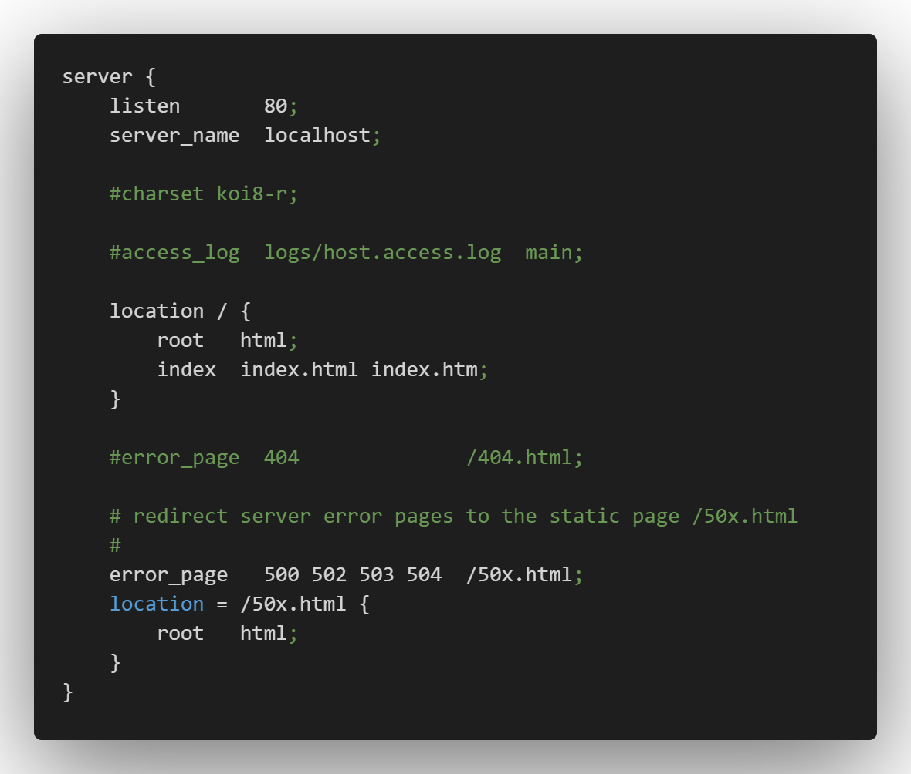

# 本地spa应用的nginx简单配置
> 最近碰到一个棘手的问题，开发打包都没问题，发到线上页面不出来报错：`Uncaught SyntaxError: Invalid or unexpected token`，为了方便调试于是使用`nginx`起本地服务，记录一下`nginx`的简单配置

- 常用命令放在前面(windows没有配置`nginx`全局环境变量的话需要到`nginx`的解压目录下运行命令)
1. 启动：`start nginx`、`nginx`
2. 停止：`nginx -s stop`、`nginx -s quit`
3. 重启：`nginx -s reload`
4. 创建`nginx.pid`文件：`nginx -c conf/nginx.conf`。这条命令在使用停止启动命令报`nginx报错[error] CreateFile()`使用

- 下载与启动
1. 下载地址[https://nginx.org/en/download.html](https://nginx.org/en/download.html)，页面有`Mainline version`(主版本)、`Stable version`(稳定版本)、`Legacy versions`(旧版本)可以下载。文章下载是稳定版，版本是`nginx-1.20.1`
2. 将下载的压缩包解压到某个文件夹下
3. 启动
    - 直接双击`nginx.exe`启动
    - 打开`cmd`命令窗口，切到`nginx`解压目录下使用`nginx`、`start nginx`启动
4. 检查`nginx`是否启动成功
    - 在浏览器地址栏输入网址`http://localhost:80`，出现`Welcome to nginx!`欢迎页面说明启动成功

- 配置一个简单的`spa`项目的`server`
1. 编辑器打开`nginx`解压目录下`/conf/nginx.conf`配置文件，默认只有一个`server`配置内容，这也是启动时欢迎页面的`server`配置
2. 在现有的`server`配置下添加新的`server`
    - `spa`应用没有基路径的`server`配置，前端文件地址结构为`项目地址/dist/index.html`
    ```
        server {
            ... // 这是当前默认server内容
        }
        server {
            listen 8888; // 监听的端口号
            server_name localhost;
            root ../[项目地址]/dist; // 前端包地址（这里基于解压后的nginx.exe所在地址使用的相对路径）

            location / {
                index /index.html;
                try_files $uri $uri/ /index.html; // spa应用的关键配置
            }
            location ^~ /api/ {
                # proxy_pass [接口代理地址]; // 接口代理地址
            }
        }
    ```
    - `spa`应用有基路径的`server`配置，如最后访问页面地址是`localhost:8888/app/[route]`，前端文件地址结构为`项目地址/dist/index.html`
    ```
        server {
            listen 8888; // 注意端口号不能重复
            server_name localhost;
            root ../[项目地址]/dist;

            location ^~ /app { // 添加访问地址的基路径
                index /index.html;
                try_files $uri $uri/ /index.html;
            }
            location ^~ /api/ {
                # proxy_pass [接口代理地址];
            }
        }
    ```
3. 添加新的`server`配置后保存`nginx.conf`文件
4. 使用`nginx -s reload`命令重启`nginx`，这时候就能访问`http://localhost:8888/`或`http://localhost:8888/app/[route]`查看对应的`spa`应用了
